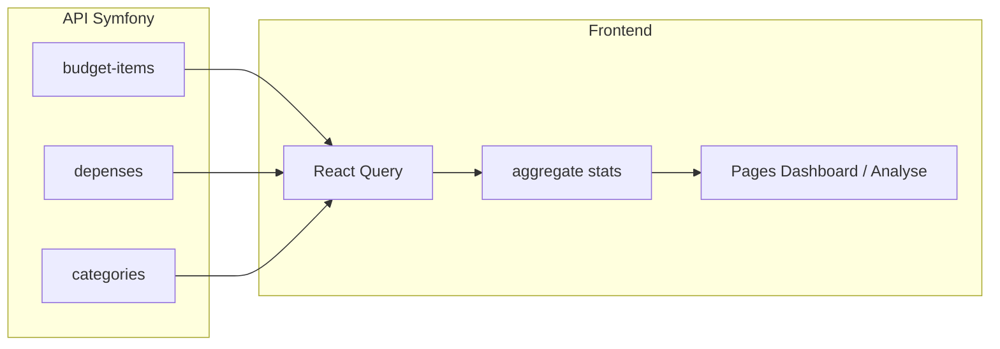

# Plan : application Trano Budget (React + Vite + TypeScript)

## Contexte

- Le répertoire `[/home/thr/Projects/household](/home/thr/Projects/household)` est **vide** : scaffolding complet nécessaire.
- D’après ta doc backend, `**GET /api/stats/dashboard`**, `**GET /api/stats/monthly`** et les **imports CSV HTTP** ne sont **pas encore** exposés. Le plan prévoit donc :
  - des **services** qui appellent ces URLs quand elles existeront ;
  - en **fallback**, un module `**stats/aggregate.ts`** (ou équivalent dans `services/`) qui calcule prévision / réel / tendances à partir de `**GET /api/budget-items`**, `**GET /api/depenses**` (avec filtres `date[after]` / `date[before]`, pagination si besoin) et `**GET /api/categories**`.

## 1. Scaffolding et configuration

- `npm create vite@latest` → React + TypeScript, nom du projet à la racine du workspace ou sous-dossier `trano-budget` selon préférence (recommandation : **racine** `household` pour coller au workspace actuel).
- Dépendances : `react-router-dom@6`, `axios`, `@tanstack/react-query`, `react-hook-form`, `@hookform/resolvers`, `zod`, `recharts`, `date-fns`, `lucide-react`, `tailwindcss` + `@tailwindcss/vite` (ou config PostCSS classique selon template Vite 6), `clsx` ou `tailwind-merge` pour les classes conditionnelles.
- **Vite** : `server.proxy` vers `http://localhost:8000` (ou variable) pour que le navigateur appelle `/api/...` sans CORS en dev ; production : `VITE_API_BASE_URL` pointant vers l’origine API.
- Fichier `**.env.example`** : `VITE_API_BASE_URL=http://localhost:8000` (ou vide si tout passe par le proxy relatif `/api`).

## 2. Alignement modèle API ↔ TypeScript

Les types fournis dans la spec sont la **vue UI** ; le JSON Symfony diffère :

| Concept  | API réelle                                                                                                      | Adaptation                                                                                                                                                                                   |
| -------- | --------------------------------------------------------------------------------------------------------------- | -------------------------------------------------------------------------------------------------------------------------------------------------------------------------------------------- |
| Budget   | `categorie` est un **objet compact** (`code`, `libelle`, `couleur`) ; création **POST** exige `**categorieId`** | Dans `[types/index.ts](src/types/index.ts)`, définir `BudgetItemApi` + helpers ; dans les hooks, exposer une forme pratique pour l’UI (`categorie` string = `code` ou `libelle` selon usage) |
| Dépense  | `categorieCode` obligatoire si pas de `budgetItem`                                                              | Mapper `categorie` (UI) ↔ `categorieCode` (payload) dans `[depenses.service.ts](src/services/depenses.service.ts)`                                                                           |
| Montants | `int` côté serveur                                                                                              | `number` en TS ; formater en Ariary via `[formatters.ts](src/utils/formatters.ts)`                                                                                                           |

Conserver `Periodicite` et les interfaces **documentées** dans `types/index.ts`, en les étendant si nécessaire (`montantMensuel`, `actif`, `CategorieCompact`, etc.).

## 3. Services et React Query

- `[src/services/api.ts](src/services/api.ts)` : instance Axios, `baseURL` depuis env, intercepteurs optionnels (erreurs 422 → format utilisable par les formulaires).
- `[budget.service.ts](src/services/budget.service.ts)`, `[depenses.service.ts](src/services/depenses.service.ts)`, `[stats.service.ts](src/services/stats.service.ts)` :
  - CRUD aligné sur les routes documentées ;
  - `stats.service.ts` : d’abord `getDashboard()` / `getMonthly(year, month)` qui **tentent** `GET /api/stats/...` ; si **404** ou désactivé via flag, déléguer à `**computeDashboardFromRaw(...)`** interne.
- Hooks `[useBudgetItems.ts](src/hooks/useBudgetItems.ts)`, `[useDepenses.ts](src/hooks/useDepenses.ts)`, `[useStats.ts](src/hooks/useStats.ts)` : clés de query stables, `invalidateQueries` après mutations, **mises à jour optimistes** sur PATCH budget-items et PATCH/POST/DELETE depenses (rollback sur erreur).

## 4. Agrégation « stats » (fallback client)

Logique minimale pour le mois courant et les 30 derniers jours :

- **Prévision par catégorie** : à partir des `budget-items`, utiliser `montantMensuel` (déjà fourni par l’API) ou, si besoin, dériver depuis `montant` + `periodicite` (même formule que le backend si documentée ; sinon règle simple documentée en commentaire court dans le code).
- **Réel par catégorie** : somme des `montant` des dépenses filtrées sur la période.
- **Budget vs réel**, **alertes** (seuils : ex. >100 % rouge, 85–100 % orange, <85 % vert), **tendance journalière** : groupBy `date` sur les dépenses.
- **Recommandations** (écran Analyse) : règles déterministes sur les écarts %, postes sans achat alors que prévu, etc., à partir des mêmes agrégats.

Quand le backend exposera les routes stats, il suffira de **basculer** `useStats` pour préférer la réponse serveur sans changer les composants graphiques (adapter les mappers si la forme JSON diffère légèrement).

## 5. UI / pages (ordre d’implémentation demandé)

1. **Layout** : `[components/layout/Sidebar.tsx](src/components/layout/Sidebar.tsx)` (Lucide + liens vers `/`, `/budget`, `/depenses`, `/analyse`), `[Header.tsx](src/components/layout/Header.tsx)`, `[Layout.tsx](src/components/layout/Layout.tsx)`, `Outlet` React Router.
2. **Design system** : Tailwind + palette (#FAF8F5, #1C1C1E, #F59E0B, #10B981, #EF4444) ; polices **DM Serif Display** + **DM Sans** via Google Fonts dans `[index.html](index.html)` ou import CSS ; cartes `rounded-2xl`, ombre légère.
3. **Dashboard** `[DashboardPage.tsx](src/pages/DashboardPage.tsx)` : composants `[KpiCard](src/components/dashboard/KpiCard.tsx)`, graphiques Recharts (`[BudgetVsReel](src/components/dashboard/BudgetVsReel.tsx)`, `[TrendChart](src/components/dashboard/TrendChart.tsx)`), `[AlertCard](src/components/dashboard/AlertCard.tsx)`, résumé dépenses du jour — données via `useStats` + `useDepenses` du jour.
4. **Budget** `[BudgetPage.tsx](src/pages/BudgetPage.tsx)` : groupes par catégorie (`[CategoryGroup](src/components/budget/CategoryGroup.tsx)`), lignes éditables (`[BudgetItemRow](src/components/budget/BudgetItemRow.tsx)`), sous-totaux, total, boutons d’ajout — **import CSV** : lecture fichier côté client, parsing, puis enchaîner **POST** successifs (avec gestion d’erreur et toast) tant qu’il n’y a pas d’endpoint d’import serveur.
5. **Dépenses** `[DepensesPage.tsx](src/pages/DepensesPage.tsx)` : `[QuickAddBar](src/components/depenses/QuickAddBar.tsx)` + RHF/Zod, autocomplete produits depuis la liste budget-items (match sur `nom`), auto-remplissage `unite` / `prixUnitaire` / catégorie ; liste groupée par date ; filtres date + catégorie ; export CSV généré côté client.
6. **Analyse** `[AnalysePage.tsx](src/pages/AnalysePage.tsx)` : tableau mensuel prévision vs réel, top 5 dépassements, drill-down catégorie, cartes de recommandations basées sur règles.

Composants réutilisables dans `[components/ui/](src/components/ui/)` : Button, Input, Badge, Card, Modal, Table — styles cohérents avec la palette chaude.

## 6. Routing et bootstrap

- `[main.tsx](src/main.tsx)` : `BrowserRouter`, `QueryClientProvider` avec options par défaut (staleTime raisonnable pour listes).
- `[App.tsx](src/App.tsx)` : routes `/`, `/budget`, `/depenses`, `/analyse` enveloppées dans `Layout`.

## 7. Fichiers utilitaires

- `[utils/categories.ts](src/utils/categories.ts)` : couleurs/icônes de secours ; priorité aux données `**GET /api/categories`** (`couleur`, `code`).
- `[utils/formatters.ts](src/utils/formatters.ts)` : `toAriary(n)`, format dates avec `date-fns` (locale `fr`).

## 8. Risques et décisions

- **Pagination dépenses** : pour l’agrégation mensuelle complète, prévoir boucle ou requête avec `itemsPerPage=100` et pages suivantes si `total` > limite.
- **422** : afficher les `violations` dans les formulaires (mapping champ → message).
- **Cohérence prévision** : s’appuyer sur `montantMensuel` de l’API quand présent pour éviter les divergences avec le backend.

## Schéma de flux données (fallback)

## Ordre de livraison concret

1. Projet Vite + deps + Tailwind + fonts + Layout + routes vides.
2. Types + api + services budget/depenses/categories + hooks.
3. Module d’agrégation stats + `useStats`.
4. Dashboard complet.
5. Budget (liste groupée + édition + CSV client).
6. Dépenses (quick add + liste + filtres + export CSV).
7. Analyse + recommandations.
8. Peaufinage responsive, états chargement/erreur, optimistic updates.

